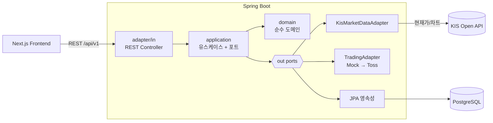
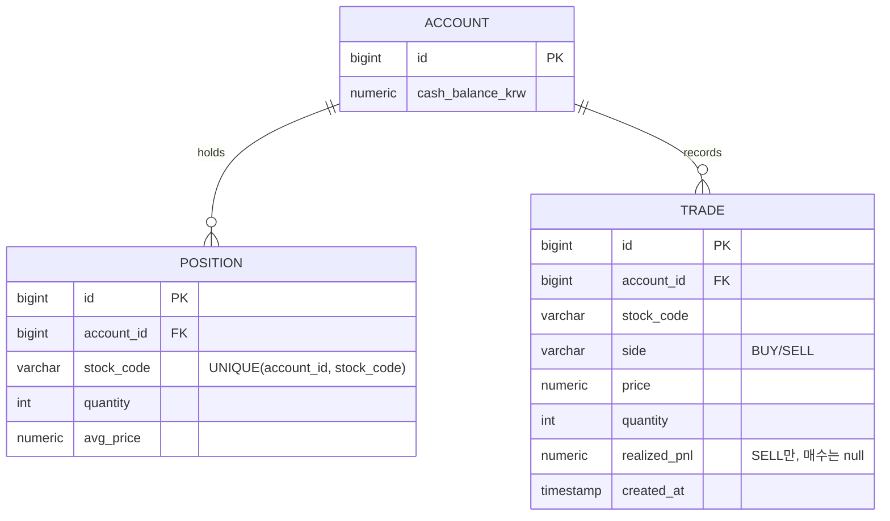

# CoinVest — 개발 설계서

> 실제 증권사처럼 동작하는 **고충실도 모의투자 + 투자 분석** 서비스. 개인 학습·사이드 프로젝트.
> **상태**: 재구축 진행 중 — 살아있는 문서. 안정적 결정은 확정, 세부(API·ERD)는 구현 중 확정.
> 최종 갱신: 2026-07-11

---

## I. 기획 및 목표

### 1. 핵심 목표 & 문제 정의

- **문제**: 실제 돈 없이 주식을 사고팔아 보고, 지금 무엇을 얼마나 들고 있으며 손익이 어떤지, "그때 샀으면 지금 얼마"인지를 실제 증권사처럼 충실하게 실험하고 싶다.
- **타겟 사용자**: 개인 투자자(본인) — 실제 자금 위험 없이 투자 판단을 실험·복기하려는 사용자.
- **핵심 가치**: 실제 증권사처럼 동작하는 고충실도 모의 거래(실제 주문만 제외) + 보유·손익·what-if 분석.

### 2. 프로젝트 개요

- **서비스명**: CoinVest · **구성**: 개인(1인) · **기간**: 2026-07 ~ (진행 중)
- **컨셉**: 한국주식부터 시작하는 고충실도 모의투자 + 분석. 한 조각(수직 슬라이스)씩 완성하며 확장(주식 → 지정가 → 미국·ETF → 코인 → 실거래).
- **최종 목표**: 실제 증권사 API(KIS 시세 / Toss 실거래) 연동.

---

## II. 시스템 설계 및 기술 선택

### 3. 시스템 아키텍처

**헥사고날(포트/어댑터)** — 도메인이 외부(웹·DB·외부 API)를 인터페이스(포트)로만 알고, 구현(어댑터)은 교체 가능.

- **통신**: 프론트 ↔ 백엔드 = REST(`/api/v1`). 백엔드 ↔ KIS = HTTPS(REST). 시세는 온디맨드 조회(MVP), 이후 폴링 → 스트리밍.
- **핵심 원칙 (실용적 포트/어댑터)**: 포트는 **교체가 실제로 필요한 외부 경계에만** 둔다 — `MarketDataPort`(KIS), `TradingPort`(모의=Mock → 실거래=Toss). 외부 API 규격 차이는 어댑터가 흡수. **영속성은 Spring Data JPA 리포지토리를 직접 사용**(이미 추상화라 별도 포트로 감싸지 않음 — 도그마틱 풀 헥사고날 지양). **모의투자는 KIS에 주문을 보내지 않고 자체 시뮬레이션 엔진이 KIS 시세 위에서 체결.**
- **인프라**: 단일 인스턴스(Oracle Cloud ARM) + Docker + nginx(배포 Phase).

### 4. 기술 스택 선택 근거

원칙: **기본(자바/스프링)으로 되는 건 기본으로.** 추가 의존성은 그 부담을 상쇄할 명확한 근거가 있을 때만.

| 분류 | 선택 | 선택 이유 | 대안 & 비교 |
|---|---|---|---|
| 언어·프레임워크 | **Java 21 + Spring Boot 3.5** | 채용 표준, 성숙한 생태계, DDD/헥사고날 적합 | Kotlin(러닝커브), Node/Nest(백엔드 깊이 약함). Boot 3.x(4.x는 신규 메이저라 자료·호환성 부족) |
| 빌드 | **Gradle** | 유연·표준 | Maven(장황) |
| DB | **PostgreSQL 16** | MySQL로도 충분하나, what-if/분석 로드맵에 유리한 **분석 SQL(윈도우 함수·CTE)** + 견고한 NUMERIC 정밀도로 선택. "필수"가 아닌 합리적 기본값 | MySQL(동등하게 가능), SQLite(단일 사용자엔 단순하나 배포·동시성 제약) |
| 아키텍처 | **실용적 포트/어댑터** | 외부 경계(시세·주문실행)에만 포트 — Mock→Toss 교체가 로드맵에 실재. 영속성은 Spring Data 직접 | 풀 헥사고날(영속성까지 포트 = 과한 boilerplate), 계층형(외부 결합 강함) |
| 마이그레이션 | **Flyway** | 버전 관리된 스키마 — `ddl-auto`(운영 안티패턴)를 피하는 정석 | Liquibase(XML 장황) |
| 테스트 | **JUnit 5 + Mockito + Testcontainers** | 유스케이스 단위(포트 mock) + 통합은 실 Postgres로 dialect 불일치 방지 | H2 인메모리(운영 DB와 불일치 위험) |
| 인증 | **Google OAuth 위임** | 직접 구현보다 안전 — "인증은 위임" 판단 자체가 실무적 | 손짠 JWT(단일 사용자엔 취약·과설계) |

> 금액·수량은 전 계층 `BigDecimal`. `double`/`float` 금지.

#### 의도적으로 채택하지 않은 것 (단순성 우선)

- **Redis 미채택**: 캐시 대상은 (a) KIS 토큰 (b) 시세뿐인데, **단일 인스턴스**라 "인스턴스 간 공유 캐시"라는 Redis의 이점이 없다. 토큰은 재시작 후 생존이 필요하지만 **이미 있는 PostgreSQL 테이블**로 영속하면 되고, 시세는 **인메모리 캐시(Caffeine/Spring Cache)**로 충분하다. Redis는 다중 인스턴스·실시간 pub/sub가 실제로 필요해질 때, 그 근거와 함께 도입한다.
- **Lombok 최소화**: DTO·값객체는 Java 21 `record`로, 엔티티 boilerplate에만 제한적으로 사용(또는 명시적 코드). 애노테이션 프로세서 의존과 암묵성을 줄인다.
- **메시지 큐(Kafka 등) 미채택**: 단일 인스턴스·현재 규모엔 스프링 `ApplicationEvent`로 충분. (옛 설계의 Kafka는 제거됨.)

### 5. 데이터 전략 & ERD

첫 슬라이스(한국주식 페이퍼 트레이딩) 도메인.

설계 노트(구현 중 확정):
- `POSITION`은 **(account_id, stock_code) UNIQUE** — 종목당 포지션 1개.
- **realized_pnl은 매도에만** (매수는 null). 매도 시 =(체결가−평단)×수량.
- 한국주식 **수량은 정수(주), 가격은 정수 KRW** — 정밀도 명시.
- 시장가 즉시 체결이라 대기주문(Order) 없이 **Trade만**. 지정가 도입 시 Order(대기) 분리.

### 6. 보안 고려 사항

- **인증**: Google OAuth 위임 + 본인 계정 화이트리스트(단일 사용자). 손짠 JWT 미도입.
- **시크릿**: KIS 앱키·토큰, DB 자격증명은 `.env`/환경변수·DB. 코드·git 하드코딩 금지(`.env` gitignore).
- **입력 검증**: Bean Validation으로 요청 DTO 검증.
- **배포 하드닝(배포 Phase)**: TLS 종단, DB 호스트 비노출, 최소 권한 컨테이너, Cloudflare Access 검토.
- **실거래 격리(최종 Phase)**: 실제 주문 경로는 확인·한도·킬스위치로 하드 격리.

---

## III. 구현 및 개발 계획

### 7. 핵심 기능 명세 (API)

첫 슬라이스 API (요청/응답 세부는 구현 중 확정):

| 메서드 | 엔드포인트 | 설명 |
|---|---|---|
| GET | `/api/v1/prices/{code}` | 한국주식 현재가(KIS) |
| POST | `/api/v1/orders` | 시장가 페이퍼 매수/매도 (side, code, qty) |
| GET | `/api/v1/holdings` | 보유 현황(종목·수량·평단·현재가·평가손익) |
| GET | `/api/v1/account` | 현금 잔고 |

향후: 거래내역 → 지정가 → T+2 정산 → 수수료 → 미국주식·ETF → what-if.

### 8. 테스트 계획

- **방식**: TDD (red → green). 슬라이스마다 실패 테스트 먼저.
- **주 seam**: 애플리케이션 유스케이스 계층 — `MarketDataPort` fake 주입, 매수/매도 시 현금·포지션·평단·실현손익 정합성을 순수 로직으로 검증(외부 의존 없음).
- **부 seam**: `KisMarketDataAdapter`의 KIS 응답 파싱을 캡처 JSON 계약 테스트.
- **통합**: Testcontainers(격리 PostgreSQL)로 영속성 왕복 최소 1건.
- **게이트**: 핵심 금융 테스트 통과 전 신규 기능 착수 금지.

---

## IV. 배포 및 운영

### 9. 배포 & CI/CD (배포 Phase)

- **공통**: 앱을 Docker 이미지로 컨테이너화. **배포 대상은 배포 Phase에서 확정**(아래 후보 비교).
- **후보 비교**:
  - (a) **Oracle Cloud ARM VM + Docker Compose** — 무료·풀 컨트롤·"실 인프라 운영" 경험. 단 OS·TLS·보안·nginx를 직접 관리(높은 운영 부담).
  - (b) **PaaS (Fly.io / Railway / Render)** — 저운영, 자동 TLS, 관리형 Postgres, 쉬운 배포. 백엔드 코드에 집중 가능. 인프라 깊이 어필은 덜함.
  - (c) **Cloud Run(GCP) 등 컨테이너 서버리스** — 관리형·scale-to-zero. 단 JVM 콜드스타트(Spring 기동)가 느려 scale-to-zero와 상성 주의.
  - ❌ **Supabase 등 풀 BaaS 부적합** — 관리형 Postgres+자동 API+Auth로 **우리가 만들려는 백엔드 자체를 대체**해 포트폴리오 목적을 훼손. (단, 관리형 Postgres 단독(Neon/Supabase-DB)은 배포 Phase에서 별도 고려.)
- **CI/CD**: GitHub Actions — PR 시 빌드+테스트 게이트, 배포는 이미지 SHA 태깅 + 롤백 스텝.
- **로컬/배포 분리**: 로컬 `docker-compose.yml`(인프라만), 배포는 대상에 맞는 구성.

### 10. 모니터링 & 트러블슈팅

- **경량 관측**: Spring Actuator `/health`(DB 포함), 에러 알림. 무거운 Prometheus/Grafana는 후순위.

### 11. 성능 목표 & 최적화 전략

- **목표(안)**: 시세·주문 API 응답 P95 < 300ms(로컬). *결과는 구현 후 측정(living).*
- **최적화**: KIS 토큰 영속 캐시(재발급 제약 대응), 시세 인메모리 캐시, 조회 인덱스. 실시간은 폴링→스트리밍 단계 전환.

---

## V. 결과 및 성과

### 12. 성과 지표 & 결과

- **정량 목표(안)**: 첫 슬라이스 종단(주문→체결→보유) 동작 + 금융 테스트 통과율 + API 응답 시간 + 에러율. *실제 달성치는 진행에 따라 갱신(living).*
