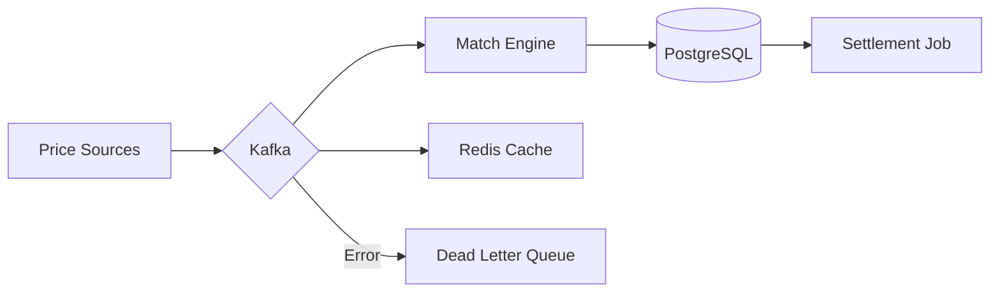

# 🚀 CoinVest: 투자상품 통합 시뮬레이션 플랫폼

> **핵심 가치**: 주식과 코인을 포함한 다양한 투자상품의 복잡한 금융 규칙을 자동화하고, 실시간 대용량 이벤트를 안정적으로 처리하여 사용자에게 가장 현실적인 투자 경험을 제공하는 시뮬레이션 플랫폼입니다.

---

## ✨ Key Features (주요 기능)

### 1. 통합 투자 대시보드 (Unified Dashboard)

- **투자상품 통합 관리**: 업비트(코인), 한국거래소(국내주식), 뉴욕증권거래소(미국주식)의 시세를 실시간으로 통합하여 하나의 포트폴리오로 관리합니다.
- **이중 통화 지원**: KRW와 USD 기반 투자상품을 동시에 보유하며, 실시간 환율이 반영된 통합 수익률 및 평가액 정보를 제공합니다.

### 2. 스마트 트레이딩 시스템 (Intelligent Trading)

- **통합 증거금 (Integrated Margin)**: 특정 통화가 부족할 경우 보유한 다른 통화에서 실시간 자동 환전을 통해 매수 주문을 즉시 실행합니다.
- **미정산 자금 재투자 (T+2)**: 주식 매도 후 아직 입금되지 않은 대금(Pending)을 시스템이 자동 계산하여 즉시 다른 투자상품 매수에 활용할 수 있는 유연성을 제공합니다.
- **자동 매매 엔진 (Stop-Loss/Take-Profit)**: 사용자가 설정한 리스크 관리 규칙에 따라 24시간 감시를 통해 최적의 타이밍에 매도 주문을 실행합니다.

### 3. 전략 봇 및 벤치마크 (Bot Ecosystem)

- **5대 핵심 전략 봇**: 모멘텀, 가치 투자, 인덱스 추적 등 고유한 알고리즘을 가진 AI 봇들이 실제 시장에서 실시간 매매를 수행합니다.
- **성과 분석**: 봇의 기간별(1M, 3M, ALL) 수익률과 승률을 벤치마크 데이터로 제공하여 투자 전략 학습을 돕습니다.

### 4. 랭킹 및 소셜 경쟁 (Competitive Ranking)

- **실시간 리더보드**: Redis ZSET 기반의 고속 집계 시스템을 통해 수만 명의 유저 및 봇 중 나의 위치를 실시간으로 확인합니다.
- **다양한 기간별 필터**: 일간, 주간, 월간 단위의 랭킹 스냅샷을 통해 시장 사이클별 우수 투자자를 선별합니다.

---

## 🛠️ Tech Stack (기술 스택)

| 분류             | 기술 스택                                                                                                                                                                                   | 도입 이유 및 역할                                       |
|:---------------|:----------------------------------------------------------------------------------------------------------------------------------------------------------------------------------------|:-------------------------------------------------|
| **Backend**    |                                                            | 가상 스레드(Virtual Thread) 기반의 고효율 I/O 및 도메인 중심 아키텍처 |
| **Frontend**   |      | Web-First & App-Ready 반응형 UI 및 최적화된 사용자 경험       |
| **Messaging**  |                                                                                                                               | 대량의 실시간 가격 이벤트 스트리밍 및 마이크로서비스 간 비동기 통신           |
| **Database**   |                                                                    | 정합성 보장을 위한 비관적 락 및 고속 집계/캐싱 시스템                  |
| **Infra**      |    | 클라우드 ARM 환경 최적화 및 고가용성 인프라 구성                    |
| **Monitoring** |                                                       | 시스템 메트릭, Kafka Lag 및 실시간 정산 상태 가시화               |

---

## 🏗️ Engineering Highlights (핵심 구현 상세)

### 🛡️ 데이터 정합성 및 부하 제어

- **데드락 방지 비관적 락**: 통합 증거금 환전 시 발생할 수 있는 Race Condition을 차단하기 위해 계좌 락 획득 순서(KRW → USD)를 강제하여 원자적 트랜잭션을 보장합니다.
- **Thundering Herd 방어**: 장 개시 시점(09:00)에 쏟아지는 대량의 예약 주문을 토큰 버킷(Token Bucket) 패턴의 분산 큐를 통해 제어하여 시스템 가용성을 유지합니다.

### 🔌 장애 내성 및 결함 격리

- **Circuit Breaker (환율 제한)**: 외부 환율 API 장애 시 MAX_AGE 검증을 통해 유효하지 않은 환율 기반의 거래를 즉시 차단하여 환차손 리스크를 방어합니다.
- **Poison Pill 격리 (DLQ)**: 비정상 데이터로 인한 전체 파이프라인 중단을 방지하기 위해 3회 재시도 후 DLQ로 자동 격리하는 예외 처리 구조를 구축했습니다.

### ⚡ 성능 최적화

- **실시간 랭킹 엔진**: 수만 명의 수익률 데이터를 Redis Sorted Set을 활용하여 O(log N) 성능으로 실시간 집계합니다.
- **DB 시계열 최적화**: 대량의 거래 및 가격 데이터를 효율적으로 저장/조회하기 위해 PostgreSQL의 **BRIN 인덱스**를 전략적으로 활용합니다.

---

## 📐 System Architecture & Folder Structure

### 🔄 데이터 흐름 파이프라인



### 📂 Folder Structure (Package by Feature)

```text
backend/src/main/java/com/coinvest/
├── global/              # 공통 설정, 예외 처리, 유틸리티
├── asset/               # 투자상품 메타데이터 관리
├── auth/                # 사용자 인증 및 인가
├── bot/                 # 매매봇 엔진 및 전략(Strategy)
├── fx/                  # 환율 데이터 및 회로 차단기
├── portfolio/           # 다중 통화 자산 평가 로직
├── price/               # 실시간 가격 수집 및 Provider 라우팅
├── ranking/             # Redis 기반 수익률 랭킹 시스템
└── trading/             # 주문 체결, T+2 정산, 예약 주문
```

---

## 🧪 Verification Strategy (검증 전략)

- **동시성 통합 테스트**: Multi-threading 환경에서 비관적 락과 데드락 방지 로직의 정합성을 검증합니다.
- **Testcontainers 활용**: 실제 인프라(DB, Kafka) 환경과 동일한 조건에서 수행되는 통합 테스트를 통해 높은 신뢰성을 보장합니다.
- **시스템 가시성**: Prometheus와 Grafana를 통해 실시간 트래픽, 에러율, 정산 대기 현황을 모니터링하여 운영 안정성을 확보합니다.

---

## 🚀 Setup & Run (시작하기)

1. **Infrastructure**: `docker-compose.yml`을 통해 전체 인프라 스택 기동
2. **Application**: Gradle 빌드 후 프로덕션 프로파일로 실행
3. **Frontend**: Vite를 통한 React SPA 빌드 및 Vercel 배포
