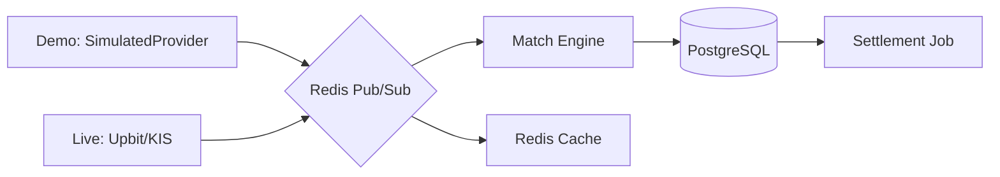

# 🚀 CoinVest: 투자상품 통합 시뮬레이션 플랫폼

> **핵심 가치**: 주식과 코인을 포함한 다양한 투자상품의 복잡한 금융 규칙을 자동화하고, 실시간 이벤트를 안정적으로 처리하여 사용자에게 가장 현실적인 투자 경험을 제공하는 시뮬레이션 플랫폼입니다.  
> **⚠️ 중요**: 본 플랫폼의 Demo 모드는 **실제 주식·암호화폐와 무관한 가상 자산**을 사용합니다. 실제 시장 데이터가 아니며, 투자 자문을 제공하지 않습니다.  
> **Demo/Live 이중 모드**: 외부 사용자는 가상 시뮬레이션 데이터, 본인은 실제 API로 24시간 운용.

🔗 **Demo**: https://coinvest.xxx *(배포 후 추가 예정)*

---

## ✨ Key Features (주요 기능)

### 1. 통합 투자 대시보드 (Unified Dashboard)

- **투자상품 통합 관리**: 코인, 국내주식, 미국주식의 시세를 통합하여 하나의 포트폴리오로 관리합니다.
- **이중 통화 지원**: KRW와 USD 기반 투자상품을 동시에 보유하며, 실시간 환율이 반영된 통합 수익률 및 평가액 정보를 제공합니다.

### 2. 스마트 트레이딩 시스템 (Intelligent Trading)

- **통합 증거금 (Integrated Margin)**: 특정 통화가 부족할 경우 보유한 다른 통화에서 실시간 자동 환전을 통해 매수 주문을 즉시 실행합니다.
- **미정산 자금 재투자 (T+2)**: 주식 매도 후 아직 입금되지 않은 대금(Pending)을 시스템이 자동 계산하여 즉시 다른 투자상품 매수에 활용할 수 있는 유연성을 제공합니다.
- **자동 매매 엔진 (Stop-Loss/Take-Profit)**: 사용자가 설정한 리스크 관리 규칙에 따라 24시간 감시를 통해 최적의 타이밍에 매도 주문을 실행합니다.

### 3. 전략 봇 및 백테스팅 레포트 (Bot Ecosystem)

- **4대 핵심 전략 봇**: 모멘텀, 평균 회귀, 인덱스 추적, 랜덤 베이스라인 알고리즘을 가진 봇들이 시뮬레이션 시장에서 24시간 매매를 수행합니다.
- **백테스팅 레포트**: 봇의 기간별(1M, 3M, ALL) 수익률·MDD·승률·샤프비율을 통계적 데이터로 제공합니다. (투자 조언이 아닌 알고리즘 성과 분석)

### 4. 개인화 벤치마크 대시보드 (Personalized Benchmark)

- **수익률 비교**: 내 포트폴리오 수익률을 가상 벤치마크 지수(KOSPI_SIM, SP500_SIM) 및 봇 전략별 수익률과 나란히 비교합니다.
- **기간별 분석**: 1M, 3M, ALL 단위의 수익률 추이를 시각화하여 나의 투자 패턴을 객관적으로 확인합니다.

---

## 🛠️ Tech Stack (기술 스택)

| 분류            | 기술 스택                                                                                                                                                                                 | 도입 이유 및 역할                                          |
|:--------------|:--------------------------------------------------------------------------------------------------------------------------------------------------------------------------------------|:----------------------------------------------------|
| **Backend**   |                                                          | 가상 스레드(Virtual Thread) 기반의 고효율 I/O 및 도메인 중심 아키텍처    |
| **Frontend**  |    | Web-First 반응형 UI, Recharts 기반 벤치마크 차트               |
| **Messaging** | Redis Pub/Sub + Spring ApplicationEvent                                                                                                                                               | 가격 이벤트 전파 및 도메인 이벤트 처리. 단일 인스턴스에서 Kafka는 과잉(4GB 절약) |
| **Database**  |                                                                  | 정합성 보장을 위한 비관적 락 및 고속 캐시/이벤트 채널                     |
| **Infra**     |    | Nginx Reverse Proxy 기반 단일 인스턴스 최적화 및 CI/CD 자동화 |

---

## 🏗️ Engineering Highlights (핵심 구현 상세)

### 🛡️ 데이터 정합성 및 부하 제어

- **데드락 방지 비관적 락**: 통합 증거금 환전 시 발생할 수 있는 Race Condition을 차단하기 위해 Balance 락 획득 순서를 **Currency enum ordinal 오름차순(KRW→USD)
  으로 고정**하여 원자적 트랜잭션을 보장합니다.
- **Thundering Herd 방어**: 장 개시 시점(09:00)에 쏟아지는 대량의 예약 주문을 토큰 버킷(Token Bucket) 패턴으로 제어하여 시스템 가용성을 유지합니다.

### 🔌 장애 내성 및 결함 격리

- **Circuit Breaker (환율)**: 외부 환율 API 장애 시 MAX_AGE(48h) 검증을 통해 유효하지 않은 환율 기반의 거래를 즉시 차단하여 환차손 리스크를 방어합니다.
- **Demo/Live 이중 모드**: 금융 API 재배포 약관 제약을 아키텍처로 해결. `UserRole → PriceMode` 런타임 분기로 외부 사용자에게는 시뮬레이션 데이터만 제공, 실제 거래소 데이터 외부
  노출 없음.

### ⚡ 성능 최적화

- **DB 시계열 최적화**: 대량의 거래 및 가격 데이터를 효율적으로 저장/조회하기 위해 PostgreSQL의 **BRIN 인덱스**를 전략적으로 활용합니다.
- **CSV 리플레이 스트레스 테스트**: 블랙 먼데이(1987), COVID(2020) 폭락장 시세 데이터를 초고속으로 주입하여 매칭 엔진 동시성과 T+2 정산 정합성 100%를 검증합니다.

---

## 📐 System Architecture & Folder Structure

### 🔄 데이터 흐름 파이프라인



### 📂 Folder Structure (Package by Feature)

```text
backend/src/main/java/com/coinvest/
├── global/        # 공통 설정, 예외 처리, PriceMode, PriceModeResolver
├── asset/         # 투자상품 메타데이터 관리
├── auth/          # 사용자 인증 및 인가 (UserRole: USER/ADMIN)
├── benchmark/     # 개인화 벤치마크 대시보드
├── bot/           # 매매봇 엔진 및 전략(Strategy Pattern)
├── fx/            # 환율 데이터, SimulatedFxProvider, Circuit Breaker
├── portfolio/     # 다중 통화 자산 평가 로직, 리밸런싱 알림
├── price/         # 실시간 가격 수집, PriceProvider 라우팅, PriceEventHandler
└── trading/       # 주문 체결, T+2 정산, 예약 주문, 손절/익절
```

---

## 🧪 Verification Strategy (검증 전략)

- **동시성 통합 테스트**: Multi-threading 환경에서 비관적 락과 데드락 방지 로직의 정합성을 검증합니다.
- **Testcontainers 활용**: 실제 인프라(DB, Redis) 환경과 동일한 조건에서 수행되는 통합 테스트를 통해 높은 신뢰성을 보장합니다.
- **CSV 리플레이 스트레스 테스트**: 극단적 시장 상황을 재현하여 매칭 엔진·정산 로직의 한계를 검증합니다.

---

## 🚀 Setup & Run (시작하기)

### Demo 모드 (기본 — API 키 불필요)

```bash
# 인프라 기동 (PostgreSQL + Redis)
docker-compose up -d

# 애플리케이션 실행
./gradlew bootRun --args='--spring.profiles.active=local'

# 프론트엔드
cd frontend && npm install && npm run dev
```

### 운영 환경 배포 (GitHub Actions)

본 프로젝트는 Oracle Cloud ARM 환경에 최적화된 CI/CD 파이프라인을 내장하고 있습니다.

1.  **GitHub Secrets 설정**:
    - `DOCKERHUB_USERNAME`, `DOCKERHUB_TOKEN`: 도커 허브 계정 정보.
    - `OCI_HOST`, `OCI_USERNAME`, `OCI_SSH_KEY`: 오라클 서버 접속 정보.
    - `APP_ENV_FILE`: `.env` 파일 내용 전체.
    - `DOCKER_COMPOSE_CONTENT`: 프로젝트의 `docker-compose.yml` 내용.
    - `NGINX_CONF_CONTENT`: `nginx/default.conf` 내용.
2.  `main` 브랜치 푸시 시 자동으로 **x86 빌드 -> ARM64 패키징 -> 서버 배포**가 진행됩니다.
3.  **초경량 모니터링**: 배포 후 관리자 계정으로 `/api/v1/dashboard/admin/metrics`에서 실시간 시스템 상태를 확인할 수 있습니다.

### Live 모드 (실제 API 연동 — 자체 배포)

Live Mode는 ADMIN 계정으로 로그인하면 자동 활성화됩니다.

**현재 (코인 전용)**: **추가 API 키 필요 없음** (Upbit 연동 이미 완료)

**향후 (Phase 5C 이후 다중 자산 추가 시)**: KIS Open API 키를 발급받아 `.env`에 설정하면 됩니다.

```bash
# Phase 5C 이후 필요 (국내·미국 주식 + 환율 변환)
KIS_APP_KEY=발급받은_앱키
KIS_APP_SECRET=발급받은_시크릿
```

| API              | 발급처                                                     | 용도                                  |
|------------------|---------------------------------------------------------|-------------------------------------|
| **KIS Open API** | [KIS Developers](https://apiportal.koreainvestment.com) | 국내·미국 주식 시세 + USD/KRW 환율 (무료 개인 계정) |

> **법적 고지**: 각 API는 개인 계정으로 발급받아 본인의 개인적 내부 이용 범위 내에서만 사용하세요. 수신한 시세 데이터를 제3자에게 재배포하는 것은 각 API 제공사의 약관에 위반됩니다.

---

> 본 플랫폼의 Demo 모드는 교육 목적 시뮬레이션입니다. 표시되는 가상 자산 데이터는 실제 시장과 무관하며 투자 자문을 제공하지 않습니다.
